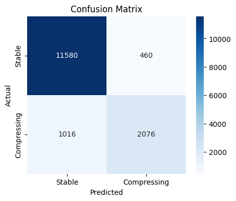
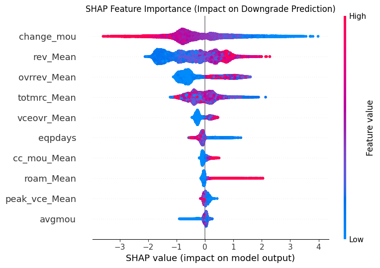

# Telecom Revenue Compression Prediction

## Tech Stack
- **Python**: Core programming language.
- **Pandas & NumPy**: Data manipulation and numerical operations.
- **Scikit-Learn**: Data splitting, ordinal encoding, and evaluation metrics.
- **XGBoost**: Core classification algorithm.
- **SHAP**: Model explainability and feature importance.
- **Matplotlib & Seaborn**: Data visualization.
- **Jupyter Notebook**: Development environment.

## What I Did
For my final project in the GCI Data Science course, I built a machine learning pipeline to predict which active telecom customers are at risk of "compressing" (downgrading their plan, defined as a revenue drop > $10). 

* **Data Cleaning & Merging**: Combined client demographics and usage records, reducing the dataset to 50,438 active customers after filtering out already-churned users. 
* **Feature Engineering**: Removed leaky variables (like current revenue and 3-month average revenue) and dropped columns with extreme missing values.
* **Imputation**: Filled missing numerical data strictly using training set medians to prevent data leakage, and applied ordinal encoding for categorical variables.
* **Modeling**: Trained an XGBClassifier (300 estimators, max depth 6) and evaluated it using a stratified 70/30 split and 5-fold cross-validation.
* **Business Simulation**: Translated model probabilities into ROI by simulating a proactive retention campaign, capping interventions at 15% to match realistic Customer Success capacity.

## Insights
- **Predicting Downgrades**: Customers are highly likely to downgrade if they show sharp drops in their recent minutes of use (`change_mou`), have high average revenue that they aren't fully utilizing (`rev_Mean`), or are getting hit with high overage fees (`ovrrev_Mean`).
- **Optimal Targeting**: Capping the intervention campaign at 15% of the customer base (max 5,295 interventions) and tuning the probability threshold strictly on the training set (0.59) prevents wasted effort on false positives. 
- **Profitability**: A highly accurate model translates directly to revenue. Retaining even 50% of the flagged customers yields massive savings that far outweigh the cost of waiving overage fees.

## Results
The XGBoost model achieved excellent predictive performance on the test set:
- **ROC-AUC:** 0.9456
- **Accuracy:** 0.9025
- **F1 Score:** 0.7377
- **Business ROI:** The model successfully flagged 2,214 customers for intervention. Assuming a 50% success rate, the campaign yields an estimated **$441,464.30** in annual net profit.

## Confusion Matrix

## Feature Importance

## Feature Dictionary

| Column Name | Explanation |
| :--- | :--- |
| **change_mou** | Percentage change in monthly minutes of use vs previous three month average |
| **rev_Mean** | Mean monthly revenue (charge amount) |
| **ovrrev_Mean** | Mean overage revenue |
| **totmrc_Mean** | Mean total monthly recurring charge |
| **vceovr_Mean** | Mean revenue of voice overage |
| **eqpdays** | Number of days (age) of current equipment |
| **cc_mou_Mean** | Mean unrounded minutes of use of customer care calls |
| **roam_Mean** | Mean number of roaming calls |
| **peak_vce_Mean** | Mean number of inbound and outbound peak voice calls |
| **avgmou** | Average monthly minutes of use over the life of the customer |

## Files
- `revenue_compression_model.ipynb`: The core Jupyter Notebook containing the data cleaning, modeling pipeline, and ROI simulation.
- `confusion_matrix.png`: Evaluation visual.
- `SHAP_Summary_Plot.png`: Feature importance visual.

---
**Author**: Gerges · Math and Computer Science, Helwan University
